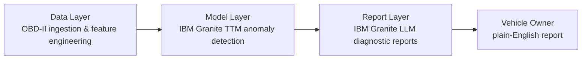

## Project Overview

Granite Lifeline is an IBM-sponsored MSc Computer Science group project at the University of Bristol, running from June to September 2026. The project aims to build an end-to-end predictive maintenance system for engine components, using OBD-II time-series data to detect anomalies and generate human-readable diagnostic reports powered by IBM Granite.

Sprint 1 runs from June 3 to June 17, 2026, covering project setup, team onboarding, workflow establishment, and initial planning.

---

## Kick Off Meeting

On June 10, the team held its first kick off meeting, formally confirming team roles, project scope, and working agreements. The session covered:

- Review of the IBM project brief and detailed description
- Confirmation of the three-layer system architecture
- Agreement on tools, workflow, and communication channels
- Division of responsibilities across the three sub-groups
- Initial discussion of the MoSCoW requirements and project deliverables

> **Key outcome:** the three-layer architecture is confirmed, roles are assigned, and Sprint 1 scope is locked in — the Data, Model, and Report Layer teams can now work in parallel against a shared interface.
{: .prompt-tip }

---

## Team Structure

The team is organised into three layers that reflect the system architecture:

| Member | Role |
|---|---|
| Charlotte Yu | System Integration & Report Layer |
| Jintong He | Report Layer |
| Lei Pei | Data Layer |
| Qiuting Fu | Data Layer |
| Lucca Zhou | Model Layer |
| Ray Wang | Model Layer |

Team roles across the three system layers.
{: .table-caption }

---

## System Architecture

The system is built on three layers that pass data forward through a defined JSON interface:

- **Data Layer** — Ingests and preprocesses the KIT Automotive OBD-II dataset, performs feature engineering including rolling averages, rate-of-change indicators, and load-based stress metrics, and simulates abnormal driving scenarios
- **Model Layer** — Uses IBM Granite TTM for time-series anomaly detection, producing risk scores and risk classifications (Low / Medium / High) per engine component
- **Report Layer** — Uses IBM Granite LLM to generate structured three-part diagnostic reports: anomalous behaviour description, probable physical root cause, and recommended inspection action

The three layers communicate via a defined JSON interface (INTERFACE.md), the first draft of which is being established during Sprint 1.

---

## Tools and Workflow

The following tools were confirmed during Sprint 1:

| Tool | Purpose |
|---|---|
| Jira | Sprint planning, backlog management, issue tracking |
| GitHub | Source control, CI/CD, code review |
| Confluence | Internal documentation, meeting notes, workflow guides |
| Discord | Team communication and async updates |
| Google Drive | Shared file storage and collaborative drafting |
| IBM Bob | AI-assisted design and development copilot |

Tools confirmed for the Sprint 1 workflow.
{: .table-caption }

A full workflow guide covering Jira conventions, GitHub branching and commit standards, PR processes, and CI pipeline phases has been established in Confluence. Key conventions include:

- **Jira hierarchy**: Epic → User Story → Task
- **GitHub branching**: `main → develop → GL-[issue-key]-[description]`
- **Commit format**: `type(scope): description`
- **CI Phase 1** (Sprint 1): syntax checks and flake8 linting

---

## IBM SkillsBuild Badge Learning

As part of the IBM learning requirement, all team members have been completing IBM SkillsBuild badge modules. These modules are directly informing the design and development approach across all three layers, particularly prompt engineering for the Report Layer and agentic AI patterns for the Model Layer.

See completed badges per team member

| Member | Completed Badges |
|---|---|
| Charlotte Yu | Generative AI Essentials: Using LLMs to Work with Data · Getting Started with Generative AI |
| Jintong He | Craft Precise Prompts for AI Models · Introduction to Large Language Models |
| Lei Pei | AI Fundamentals: Language and Vision in AI · Generative AI Essentials: Using LLMs to Work with Data |
| Qiuting Fu | Build Your First Chatbot Using IBM watsonx · Intelligent by Design: Build an AI Agent |
| Lucca Zhou | Getting Started with Artificial Intelligence · Getting Started with Generative AI |
| Ray Wang | Classifying Data Using IBM Granite · Make Agentic AI Work for You |

IBM SkillsBuild badges completed by each team member.
{: .table-caption }

---

## Project Proposal

The team collectively completed and submitted a project proposal as part of the University of Bristol workshop requirement, outlining the project motivation, proposed architecture, dataset selection (KIT Automotive OBD-II), and initial MoSCoW requirements.

---

## What Comes Next

Before Sprint 1 closes on June 17, the team is working towards the following deliverables:

- Each sub-group drafting User Stories and Acceptance Criteria (in Given-When-Then format) for their respective Epics
- An initial draft of the system interface specification (INTERFACE.md v0.1), defining the JSON fields passed between the Data, Model, and Report layers
- Finalising the Sprint 2 backlog ready for Sprint Planning

A Sprint 1 closing summary will be published once these deliverables are complete.
