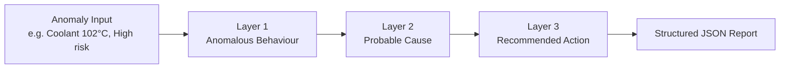

## What We Were Trying to Solve

Granite Lifeline generates plain-English diagnostic reports for
vehicle owners using IBM Granite LLM. The report layer takes
anomaly detection output from IBM Granite TTM and produces three
sections: what is happening, why it might be happening, and what
the owner should do next.

Before we could build the full pipeline, we needed to decide which
Granite model to use. We wanted evidence, not guesswork.

## How We Evaluated

We tested four IBM Granite instruct models: granite3.3:2b,
granite3.3:8b, granite4.1:3b, and granite4.1:8b. Each model ran
the same three-layer prompt chain on an identical test input — a
typical cooling system stress scenario with coolant temperature at
102°C, above the normal range of 90–95°C, at High risk.

We scored each model across five dimensions drawn from the
academic literature on LLM evaluation for fault diagnosis (Qi et
al., 2025; Huang et al., 2025):

| Dimension | Weight |
|---|---|
| Plain language quality | `██████` 30% |
| Specificity and data grounding | `█████` 25% |
| JSON parse success rate | `████` 20% |
| Recommended action quality | `███` 15% |
| Avoiding over-certainty | `██` 10% |

Scoring weights used to evaluate each candidate model.
{: .table-caption }

Plain language quality carries the highest weight because our
primary user is a non-technical vehicle owner. A report that
sounds like a data dump fails the most important requirement.

## What We Found

All four models successfully referenced the concrete sensor value
(102°C) and normal range (90–95°C) in their outputs, confirming
that our context injection pipeline works as intended. All four
models also used appropriately hedged language — phrases like
"could be related to" and "may indicate" — rather than claiming a
confirmed fault.

The differences appeared in output quality and reliability.
granite3.3:2b encountered a JSON parse failure on layer 2 because
it included bullet points inside a JSON string value, breaking the
pipeline. granite3.3:8b and granite4.1:3b both produced clean,
readable outputs. granite4.1:8b stood out with the most specific
recommended actions: concrete steps like waiting 30 minutes before
checking coolant and locating the MIN/MAX marks on the reservoir.

> granite3.3:2b broke the pipeline by embedding bullet points inside a JSON string value on layer 2 — a reminder that smaller models need stricter output-format guardrails before they can be trusted in production.
{: .prompt-warning }

## The Decision

> **Decision:** granite4.1:8b is selected as our primary model, with granite4.1:3b retained as a fallback if speed or hardware constraints become a factor.
{: .prompt-tip }

The full evaluation results and scoring rationale are
documented in ADR 302 in our repository.

For production delivery, we will transition from Ollama local
inference to IBM watsonx.ai using the equivalent Granite 4.1 8B
instruct model.

## What This Means for the Project

Having a confirmed model means the rest of the report layer can
now be built with confidence. GL-30 — our three-scenario
comparison across typical, atypical, and contradictory fault cases
— is the next step, using granite4.1:8b as the confirmed model.
