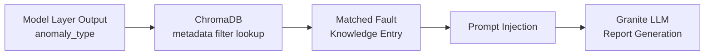

Sprint 2 has been one of our most research-intensive sprints so far. While the Model Layer team worked on anomaly detection and the Data Layer team refined our OBD-II feature engineering, the Report Layer team spent this sprint doing something a little different: reading workshop manuals.

## Building the Fault Knowledge Base

One of the core requirements for Granite Lifeline is that the diagnostic reports it generates are accurate, specific, and grounded in real automotive knowledge — not generic summaries that could apply to any car problem. To achieve this, we needed to build a fault knowledge base: a structured collection of descriptions, causes, and recommended actions for each type of engine fault our system can detect.

Our system currently identifies seven proxy failure types:

- Cooling system degradation
- Intake air temperature sensor fault or heat soak
- MAF sensor anomaly
- MAP sensor plausibility fault
- Electronic throttle tracking fault
- Accelerator pedal sensor fault
- Idle speed control degradation

For each of these, we researched and compiled fault knowledge from automotive engineering references — including the Bosch Automotive Handbook, Mitsubishi and Nissan workshop manuals, NGK technical bulletins, and several diagnostic resources. Every entry includes a plain-language description of the fault, a list of probable causes, and recommended inspection actions organised by risk level (low, medium, high).

This was painstaking work, but it forms the foundation of everything the Report Layer will produce.

## Grounding the Knowledge in Real Sensor Data

The fault descriptions aren't written from theory alone — they're checked against the OBD-II signal patterns the Model and Data Layer teams have been analysing from the KIT Automotive dataset.

_Normal coolant warm-up trajectory (P10-P90 range) against the 90-95°C stable reference band used to define the cooling system degradation fault._

Knowing what a _normal_ warm-up curve looks like is what lets the Report Layer describe a _deviation_ from it in concrete terms, rather than a vague "temperature seems high."

_Spearman correlation across core OBD-II signals — this is why some proxy failure types (like intake air temperature sensor faults) need to be cross-checked against correlated signals such as ambient temperature before being flagged with confidence._

## Why the LLM Needs a Knowledge Base

IBM Granite 4.1 8B is a powerful language model, but like all LLMs, it can produce plausible-sounding content that is technically incorrect — a problem known as hallucination. In a diagnostic context, hallucinated recommendations could mislead vehicle owners into ignoring real problems or performing unnecessary repairs.

To address this, we are using a technique called Retrieval-Augmented Generation, or RAG. The idea is simple: before asking the model to write a diagnostic report, the system first looks up the relevant fault knowledge entry for the detected anomaly type, then gives that information to the model as context. Think of it as handing an expert a reference sheet before asking them to write a report — the output is grounded in verified information rather than the model's general training knowledge.

## How We Designed the Retrieval Step

We considered three approaches for getting the right fault knowledge into the model's prompt:

The simplest option was to embed all seven fault knowledge entries directly into every prompt. This works but is wasteful — the model has to process knowledge about six anomaly types it doesn't need for every single report.

The second option was semantic vector search, where the system would search the knowledge base using the similarity of meaning. This is the classic RAG approach, but it introduces uncertainty: the correct entry might not always rank highest depending on how the query is phrased.

We chose a third approach: metadata-filtered retrieval. Because the anomaly type is already confirmed by the Model Layer — it tells the Report Layer exactly which fault was detected — we can look up the matching knowledge entry directly using an exact match on the anomaly type name. No fuzzy search needed. This makes retrieval deterministic and reliable.

The knowledge base is stored in ChromaDB, a lightweight local vector database, and retrieved using LangChain. Each fault knowledge entry is tagged with its anomaly type, and the retrieval step simply fetches the matching entry by that tag.

> **Decision:** metadata-filtered retrieval over semantic vector search — since the anomaly type is already known, an exact tag match is simpler and more reliable than similarity search, with no ranking uncertainty.
{: .prompt-tip }

## Choosing the Right Granite Model

We also completed our model selection evaluation this sprint. We tested four IBM Granite models — granite3.3:2b, granite3.3:8b, granite4.1:3b, and granite4.1:8b — against our three-layer prompt chain using a cooling system stress test scenario.

granite4.1:8b came out clearly on top, producing the most specific and actionable recommended actions, consistently referencing actual sensor values, and achieving a 100% JSON parse success rate across all three prompt layers. granite4.1:3b is retained as a fallback if inference speed becomes a concern in later sprints.

## What's Next

Sprint 3 will focus on implementation. We will build the RAG pipeline using LangChain and ChromaDB, integrate it with the three-layer Granite LLM prompt chain, and run the full Report Layer pipeline end-to-end for the first time. We are looking forward to seeing the system generate its first complete diagnostic report from real OBD-II data.
