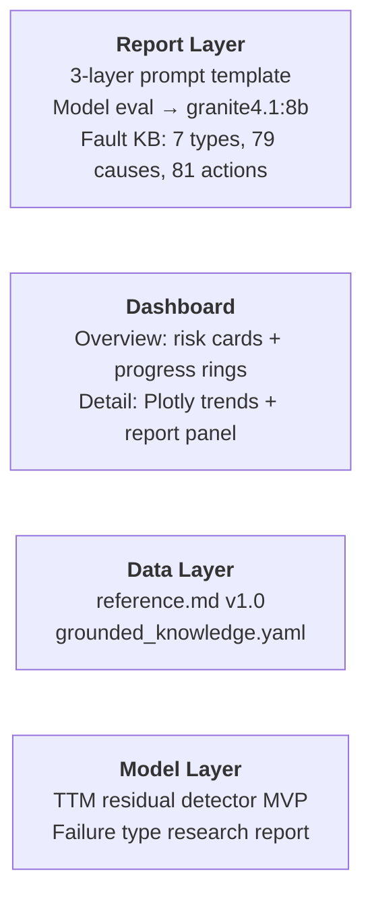

Sprint 2 is officially wrapped. It has been our most technically substantial sprint so far — the team delivered across all three layers, and we closed the sprint with a retrospective meeting to reflect on what went well, what needs improvement, and what carries into Sprint 3.

## What We Delivered

### Report Layer

The Report Layer team completed the three-layer prompt template for diagnostic report generation, covering anomaly description, probable cause, and recommended action. Charlotte ran a model comparison evaluation across four IBM Granite models — granite3.3:2b, granite3.3:8b, granite4.1:3b, and granite4.1:8b — and selected granite4.1:8b as the primary model based on output quality, JSON parse reliability, and specificity of recommended actions. This decision is documented in ADR 302.

The fault knowledge base was completed this sprint. All seven proxy failure anomaly types now have full report_layer sections in grounded_knowledge.yaml, covering descriptions, causes, and risk-level-classified actions — 79 causes and 81 actions in total, sourced from the Bosch Automotive Handbook, workshop manuals, and manufacturer technical bulletins. ADR 303 documents the RAG knowledge base design decision: metadata-filtered retrieval using ChromaDB, which ensures deterministic and reliable retrieval at inference time.

### Dashboard

The dashboard made significant progress this sprint. The Overview Page displays risk cards with animated progress rings for each component, sorted by risk level, with full light and dark mode support.

_Overview page, light theme — risk cards sorted by severity, with an urgent-attention banner when any component needs review._

_Overview page, dark theme._

The Detail Page shows a Plotly interactive trend chart, a key signals table with ABNORMAL/NORMAL badges, and a three-section diagnostic report panel.

_Risk score gauge and trend chart for the Cooling System component._

_Key signals table and the three-part diagnostic report — what's happening, why it matters, and what to do next._

The interface also degrades gracefully when data is incomplete — rather than showing a broken chart, affected sections display a clear notice.

_Air Intake System detail view when risk trend and key signals data are incomplete._

### Data Layer

Lei completed the ground knowledge document structure and reference.md v1.0, which covers all OBD-II signals, derived features, and proxy failure definitions. Qiuting built grounded_knowledge.yaml for structured storage. Feature engineering and data cleaning work is ongoing and carries into Sprint 3.

### Model Layer

Lucca delivered the Group 2 MVP pipeline, including a TTM residual detector for anomaly detection on the KIT OBD-II dataset. The failure type research report was also published to the repository.

---

## Retrospective: What We Discussed

We held a combined Sprint 2 Retrospective and Sprint 3 Planning meeting on 1 July, attended by Charlotte, Jintong, Layla, Qiuting, and Ray.

> **New team commitment:** every significant decision — model selection, architecture choices, interface changes — should be followed by a short blog post or ADR. The goal is a living record of _why_ we made each decision, not just _what_ we built.
{: .prompt-info }

**Interface alignment.** INTERFACE.md has been updated to reflect the anomaly_type naming in grounded_knowledge.yaml, and expanded from 3 to 7 anomaly types. Any mismatches should be raised in Discord immediately, not left until they cause a pipeline failure.

**Supervisor engagement.** We encouraged everyone to speak up more in meetings with the professor. The more context the supervisor has, the better the guidance they can give. There are no wrong things to say.

**Blockers.** No IBM-facing blockers were raised. Friday Office Hour remains the right time to surface anything that needs IBM support.

---

## Incomplete Tasks Carrying into Sprint 3

> Two tasks were not completed in Sprint 2 and carry directly into Sprint 3 as priorities.
{: .prompt-warning }

**GL-78 and GL-105** (data cleaning pipeline and documentation) are in progress. GL-105 was added late in the sprint and did not have enough time to complete. Its purpose is to support blog writing and file structure optimisation, so it can be finished alongside Sprint 3 work.

**GL-90** (feature engineering) was delayed because the logic for layering working conditions was completely overhauled during the sprint, which changed the window generation approach and pushed feature engineering back. This carries directly into Sprint 3 as a priority for the Data Layer.

---

## What's Next

Sprint 3 begins on 2 July. The Report Layer will implement the RAG pipeline end-to-end using ChromaDB and LangChain, and expand the dashboard to cover all 7 anomaly types with real data. The Data Layer will complete feature engineering, baseline statistics, and proxy signature replay analysis. The Model Layer will finalise the interface, verify data quality, and update the ingestion pipeline.
